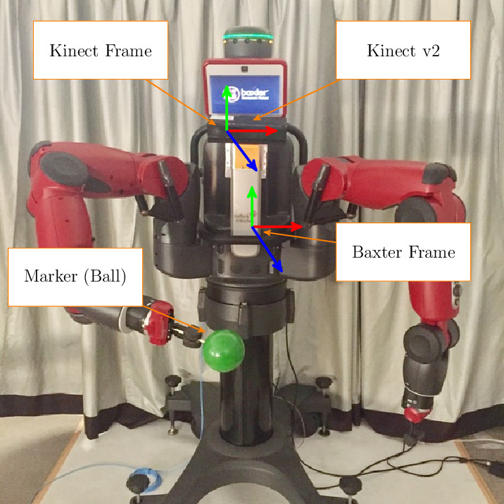

# multiple_kinect_baxter_calibration
This repository contains code for autonomous calibration of Baxter robot and Kinect camera. It supports multiple Kinect sensors.

## Dependencies
* [Baxter SDK](https://github.com/RethinkRobotics/baxter)
  * Steps to install Baxter SDK can be found [here](http://sdk.rethinkrobotics.com/wiki/Workstation_Setup)
* [iai_kinect2](https://github.com/code-iai/iai_kinect2)
  * Tools for using the Kinect v2 in ROS
* [kinect_anywhere](https://github.com/ravijo/kinect_anywhere)
  * If you want to use Kinect v2 on windows 

## Installation
1. Download or clone the repository to the source directory of ROS workspace
1. Compile the workspace by using `catkin_make`
1. Mark the python scripts executable by using command below-
```
roscd multiple_kinect_baxter_calibration/scripts
chmod +x *.py
```
## Steps for calibration
There are following three steps of the calibration process-
1. Place the marker on Baxter arm
1. Define a trajectory of Baxter arm
1. Collect the data
1. Compute the calibration
1. Publish the calibration

Below are the details of each step.

### Place the marker on Baxter arm
We are using a green colored sphere as a marker as shown below-


### Define a trajectory of Baxter arm
Each Baxter Kinect setup varies due to the the location of camera. Hence, prior to data collection step, we must need to define a trajectory of Baxter arm by following steps mentioned below-
1. Record way-points of the arm trajectory by executing the following script. 
```
rosrun multiple_kinect_baxter_calibration trajectory_waypoints_recorder.py _file:=baxter.csv _limb:=right
```
Following are the valid parameters for this script-
  * `_file:=` [type: string] filename to store all the way-points as csv.
  * `_limb:=` [type: string] name of the baxter arm, in which the marker is attached. The value of this parameter can only be `left` or `right`
2. Make sure to enable the [Zero-G mode](http://sdk.rethinkrobotics.com/wiki/Zero-G_Mode) so that the arm can be moved easily to any location by grasping the cuff over its groove. 
3. Press the `Baxter` button on the arm in order to record the way-point.
4. Record 10 (higher is better) different way-points. Press <kbd>CTRL</kbd>+<kbd>C</kbd> to stop the recording process.

### Collect the data
1. Start the kinect by using following command-
  * For iai_kinect2: `roslaunch kinect2_bridge kinect2_bridge.launch`
    *  Following are the valid parameters for this script. [Check here](https://github.com/code-iai/iai_kinect2/tree/master/kinect2_bridge#usage)
  * For kinect_anywhere: `roslaunch kinect_anywhere kinect_anywhere.launch pointcloud:=true kinect_frame:=kinect2_link`
    *  Following are the valid parameters for this script. [Check here](https://github.com/ravijo/kinect_anywhere#steps-to-run)
2. Start collecting the data by using following command-
```
roslaunch multiple_kinect_baxter_calibration calibration_data_collector.launch topic:=/kinect2/sd/points kinect2_trajectory:=/home/ravi/ros_ws/src/multiple_kinect_baxter_calibration)/files/baxter.csv
```
Following are the valid parameters for this script-
  * `topic:=` [type: string] rostopic for receving point cloud
  * `limb:=` [type: string] limb used in calibration process
  * `log:=` [type: string] log level parameter. It must be one of the following- Info, Debug, Warn, Error, Fatal.
  * `kinect1_trajectory:=` [type: string] full path to the baxter arm pre-defined trajectory for kinect1
  * `kinect2_trajectory:=` [type: string] full path to the baxter arm pre-defined trajectory for kinect2
  * `kinect3_trajectory:=` [type: string] full path to the baxter arm pre-defined trajectory for kinect3
  * `kinect_anywhere_trajectory:=` [type: string] full path to the baxter arm pre-defined trajectory for kinect anywhere
  * `min_hsv:=` [type: string] minimum HSV value for sphere segmentation as `min_hsv:="[40, 50, 60]"`
  * `max_hsv:=` [type: string] maximum HSV value for sphere segmentation as `max_hsv:="[60, 200, 255]"`
  * `radius:=` [type: float] radius of sphere (in meter)
  * `offset:=` [type: float] length of stick to hold the sphere (in meter)
  * `k_neighbors:=` [type: int] number of 'k' nearest neighbors to use for feature estimation
  * `weight:=` [type: double] normal angular distance weight
  * `max_itr:=` [type: int] maximum number of iterations before giving up
  * `d_thresh:=` [type: double] distance to the model threshold
  * `prob:=` [type: double] probability of choosing at least one sample free from outliers
  * `tolerance:=` [type: double] tolerance in radius (in meters)
  * `epsilon:=` [type: double] angle epsilon (delta) threshold (in degree)
  * `data_dir:=` [type: string] directory for saving tracking data
  * `queue_size:=` [type: int] queue_size for the subscribers
  * `wait_time:=` [type: double] wait time to stablize arm before capturing point cloud (in seconds)
  * `max_samples:=` [type: int] maximum number of samples at any waypoint
  * `min_z:=` [type: float] minimum z coordinate value of point cloud w.r.t. camera
  * `max_z:=` [type: float] maximum z coordinate value of point cloud w.r.t. camera
  * `title_bar_height:=` [type: int] height of the title bar in point cloud visualizer window (in pixel)
  
### Compute the calibration
```
roslaunch multiple_kinect_baxter_calibration calibration_compute.launch kinect:=kinect2
```
Following are the valid parameters for this script-
  * `data_dir:=` [type: string] directory of baxter_trajectory and kinect_trajectory file
  * `kinect:=` [type: string] name/id of the kinect as `kinect:=kinect1`

### Publish the calibration
```
roslaunch multiple_kinect_baxter_calibration calibration_publisher.launch calibration:="[kinect2]"
```
Following are the valid parameters for this script-
  * `data_dir:=` [type: string] directory of baxter_trajectory and kinect_trajectory file
  * `calibration:=` [type: string] all the names/ids of the kinects as `calibration:="[kinect1, kinect2, kinect3]"`

## Other utility files
### view_cloud_realtime
To view the point cloud data in real-time
```
rosrun multiple_kinect_baxter_calibration view_cloud_realtime _topic:="/kinect2/sd/points"
```
Following are the valid parameters for this script-
  * `data_dir:=` 
  
### save_pcd
To save the point cloud data in a PCD file
```
rosrun multiple_kinect_baxter_calibration save_pcd _topic:="/kinect2/sd/points"
```
Following are the valid parameters for this script-
  * `_topic:=` [type: string] rostopic for subscribing to point cloud
  * `_source:=` [type: string] source of the point cloud. It can be `Windows` or `linux`

### view_pcd
To visualize the stored point cloud file
```
rosrun multiple_kinect_baxter_calibration view_pcd _file:=scene.pcd
```
Following are the valid parameters for this script-
  * `_file:=` [type: string] full path of the point cloud file
  * `_source:=` [type: string] source of the point cloud. It can be `Windows` or `linux`

Please press <kbd>j</kbd> to take screenshot of the current scene.

### segment_image
To find out the HSV range of the colored marker in the image
```
rosrun multiple_kinect_baxter_calibration segment_image _file:=scene.jpg
```
Following are the valid parameters for this script-
  * `_file:=` [type: string] full path of the image file

### view_image
To find out the RGB and HSV value of any pixel in the image
```
rosrun multiple_kinect_baxter_calibration view_image _file:=scene.jpg
```
Following are the valid parameters for this script-
  * `_file:=` [type: string] full path of the image file

## sphere_detector_test
To test whether sphere segmentation is working or not
```
rosrun multiple_kinect_baxter_calibration sphere_detector_test _file:=scene.pcd
```
Following are the valid parameters for this script-
  * `_file:=` [type: string] full path of the point cloud file
  * `_r:=` [type: float] radius of sphere (in meter)
  * `_min_h:=` [type: int] minimum hue for sphere segmentation
  * `_min_s:=` [type: int] minimum saturation for sphere segmentation
  * `_min_v:=` [type: int] minimum value for sphere segmentation
  * `_max_h:=` [type: int] maximum hue for sphere segmentation
  * `_max_s:=` [type: int] maximum saturation for sphere segmentation
  * `_max_v:=` [type: int] maximum value for sphere segmentation
  * `_source:=` [type: string] source of the point cloud. It can be `Windows` or `linux`

## For three Kinects running on iai_kinect2
1. Initialize project and start all the kinects
```
roslaunch multiple_kinect_baxter_calibration init.launch
```
2. Collect the data for `kinect1`
```
roslaunch multiple_kinect_baxter_calibration calibration_data_collector.launch topic:=/kinect1/sd/points
```
3. Compute the calibration for `kinect1`
```
roslaunch multiple_kinect_baxter_calibration calibration_compute.launch kinect:=kinect1
```
4. Repeate steps 2 and 3 for `kinect2` and `kinect3`
5. Publish the calibration data
```
roslaunch multiple_kinect_baxter_calibration calibration_publisher.launch calibration:="[kinect1, kinect2, kinect3]"
```

## For kinect_anywhere
```
roslaunch kinect_anywhere kinect_anywhere.launch color:=false body:=true pointcloud:=true kinect_frame:=kinect1_link
roslaunch multiple_kinect_baxter_calibration calibration_data_collector.launch topic:=/kinect_anywhere/point_cloud/points2
roslaunch multiple_kinect_baxter_calibration calibration_compute.launch kinect:=kinect_anywhere
```
Open calibration file and modify child to `kinect1_link`
```
roslaunch multiple_kinect_baxter_calibration calibration_publisher.launch calibration:="[kinect_anywhere]"
```

 
